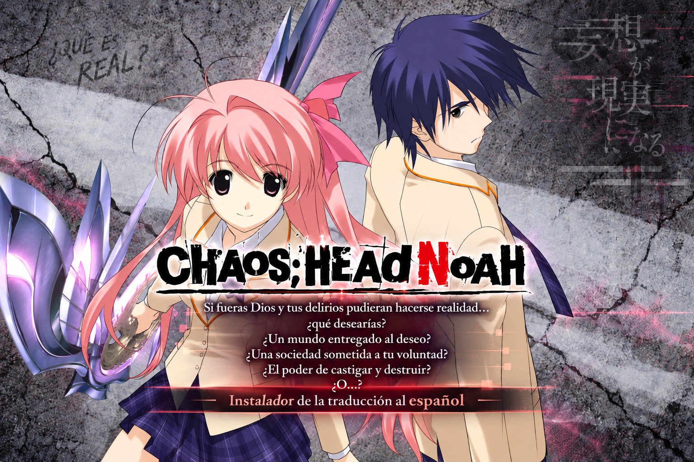
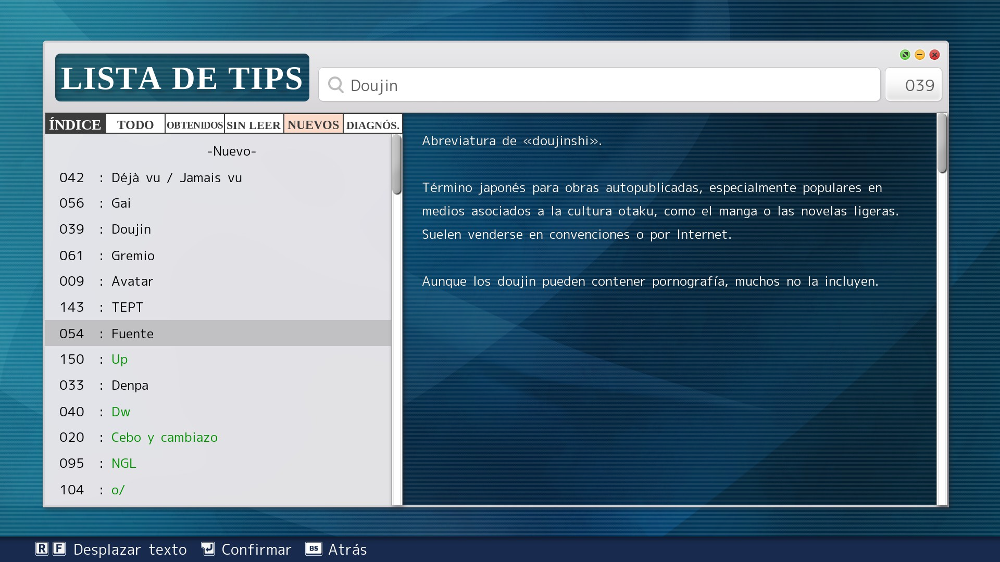
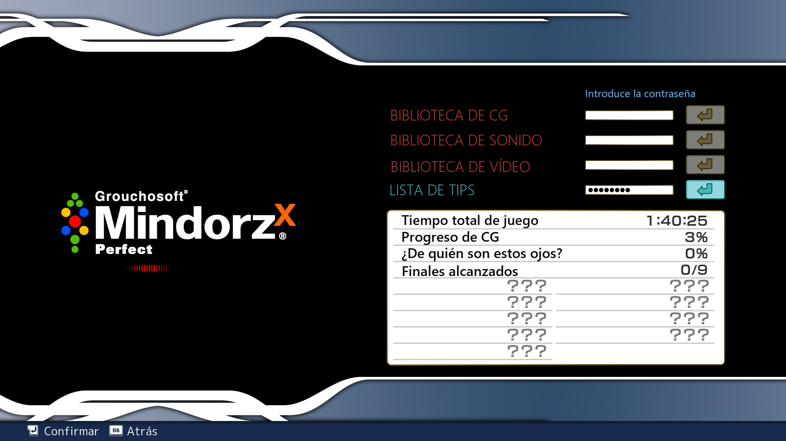
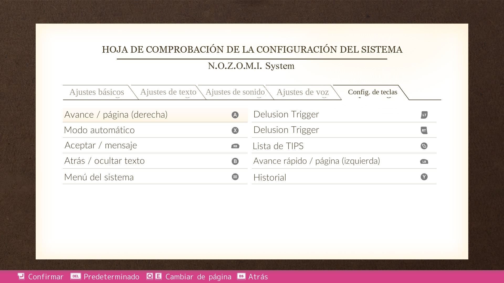
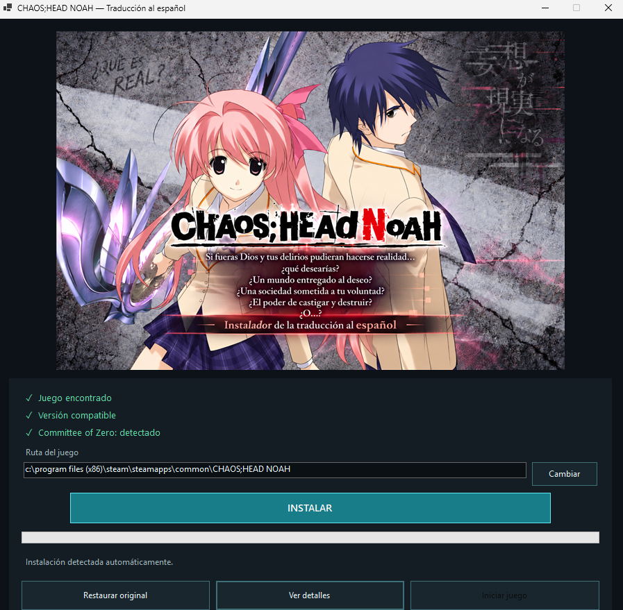
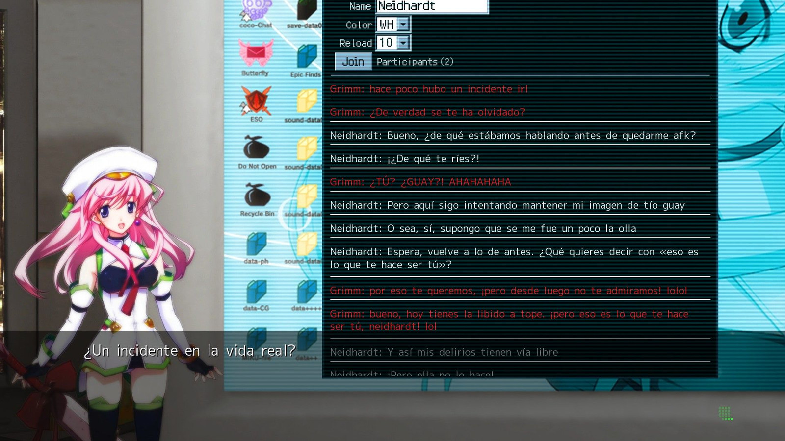
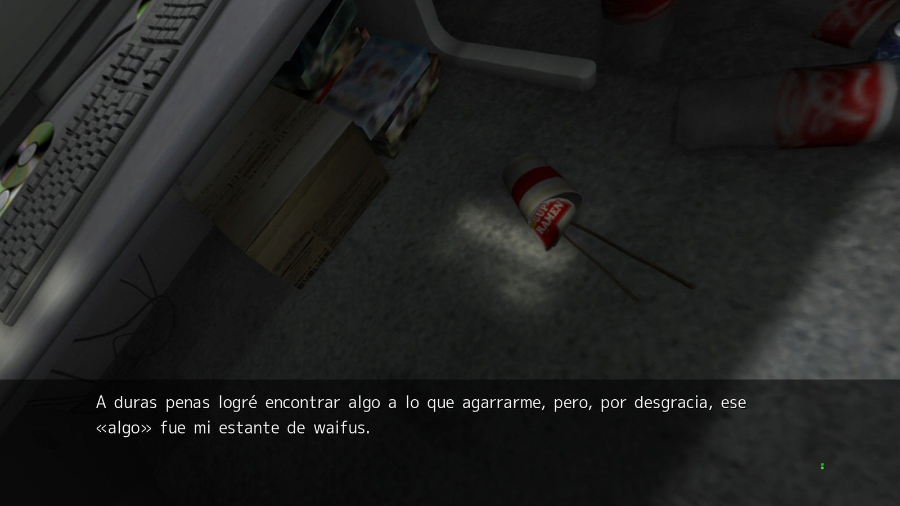
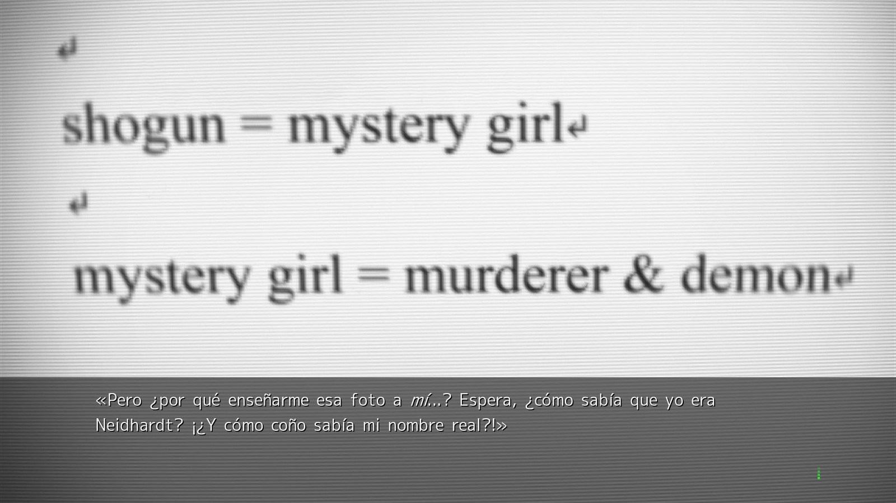

  

# CHAOS;HEAD NOAH — Traducción al español

Traducción completa al castellano de **CHAOS;HEAD NOAH**, revisada editorialmente y preparada para la versión de Steam con Committee of Zero CHAOS;HEAD NOAH Overhaul Patch 1.1.3.

**Disponible:** versión pública `v1.1.0`. Descarga el instalador y sus sumas SHA-256 desde la [release v1.1.0](https://github.com/rubocopter/chaos-head-noah-es/releases/tag/v1.1.0). La [v1.0.0](https://github.com/rubocopter/chaos-head-noah-es/releases/tag/v1.0.0) permanece disponible.

[Consultar Releases](https://github.com/rubocopter/chaos-head-noah-es/releases) · [Ver cambios](CHANGELOG.md) · [Informar de un problema](https://github.com/rubocopter/chaos-head-noah-es/issues/new/choose)

## La traducción

El texto completo se revisó teniendo en cuenta el contexto de cada escena, las voces de los personajes, la terminología y el registro. También se validaron la estructura de los guiones, las cursivas, los hablantes y los caracteres necesarios para mostrar correctamente el español.

La traducción se instala sobre el parche de Committee of Zero. El instalador comprueba la compatibilidad, guarda una copia de los archivos que modifica, verifica el resultado y permite restaurar el estado anterior.

La `v1.1.0` añade **nueve recursos gráficos de interfaz en español**: configuración, biblioteca, música, accesos rápidos, TIPS, álbum y backlog. La traducción narrativa de `v1.0.0` se conserva íntegra. Los recursos de interfaz se aplican a `languagebarrier/c0data.cpk` de CoZ 1.1.3; los archivos originales `system_eng.cpk` y `manual_eng.cpk` no se modifican.

## Capturas de la interfaz v1.1.0

## Capturas de la traducción narrativa

## Requisitos

- Una copia legítima de **CHAOS;HEAD NOAH para Steam**.
- **CHAOS;HEAD NOAH Overhaul Patch 1.1.3** de Committee of Zero, instalado antes de esta traducción. Descárgalo desde la [página oficial del proyecto](https://sonome.dareno.me/projects/chn-patch.html) o sus [releases oficiales](https://github.com/CommitteeOfZero/chn-patch/releases).
- Windows de 64 bits.

El instalador acepta la combinación compatible exacta: comprueba `Game.exe`, la información de versión de CoZ (`intVersion: 8`) y los archivos `c0script.cpk`, `c0mes00.cpk`, `c0mes01.cpk` y `languagebarrier/c0data.cpk`. Si detecta otra versión o una base modificada, se detiene sin instalar la traducción.

Committee of Zero es un requisito externo. Este proyecto no incluye ni redistribuye su parche; instálalo desde sus canales oficiales antes de continuar.

## Instalación

1. Instala CHAOS;HEAD NOAH desde Steam.
2. Instala Committee of Zero CHAOS;HEAD NOAH Overhaul Patch 1.1.3 desde su fuente oficial.
3. Descarga `CHAOS-HEAD-NOAH-ES-Setup.exe` desde la [release v1.1.0](https://github.com/rubocopter/chaos-head-noah-es/releases/tag/v1.1.0).
4. Ejecuta el instalador y comprueba que reconoce el juego y Committee of Zero.
5. Pulsa **Instalar** y espera a que termine la verificación.

El instalador detecta la carpeta de Steam automáticamente. Si fuera necesario, puedes seleccionarla con **Cambiar**. También puedes actualizar directamente una instalación española `v1.0.0`: se conserva su copia de seguridad histórica y se crea la copia correspondiente a `v1.1.0`.

La instalación puede tardar más que en `v1.0.0` porque reconstruye, respalda y verifica `c0data.cpk`, un archivo de aproximadamente 2,26 GB. Espera a que el instalador termine. La descarga no incluye CPK originales ni CPK traducidos completos. Al finalizar, el instalador no inicia el juego ni el launcher de CoZ; su configuración queda en manos del usuario.

## Restaurar los archivos originales

Abre de nuevo el instalador y pulsa **Restaurar original**. Se recuperan los archivos guardados antes de la instalación, incluidos `c0mes01.cpk` y `c0data.cpk` originales de Committee of Zero. La restauración comprueba sus hashes.

## Compatibilidad

Esta versión está preparada exclusivamente para CHAOS;HEAD NOAH de Steam junto con Committee of Zero CHAOS;HEAD NOAH Overhaul Patch 1.1.3 (`intVersion: 8`) y sus archivos compatibles. El instalador valida las versiones mediante sus archivos y hashes; no intentes aplicarlo sobre otra edición o una instalación modificada.

La traducción se probó dentro del juego con esta versión. Si aparece un error puntual, repórtalo con una captura y el contexto de la escena para poder corregirlo en una actualización.

## Problemas y contacto

Usa [Issues](https://github.com/rubocopter/chaos-head-noah-es/issues/new/choose) para informar de:

- **Instalación:** indica el mensaje del instalador y adjunta una captura. No publiques rutas que contengan datos personales.
- **Traducción:** adjunta una captura, indica la escena o el contexto y copia el texto problemático.
- **Compatibilidad:** especifica la edición del juego y la versión de Committee of Zero. No compartas archivos del juego ni del parche.

Comprueba primero que usas CoZ 1.1.3 y que el instalador no informa de una versión incompatible.

## Créditos y aviso

- **CHAOS;HEAD NOAH:** MAGES. / Spike Chunsoft y sus titulares correspondientes.
- **CHAOS;HEAD NOAH Overhaul Patch:** Committee of Zero.
- **Traducción al español:** proyecto `chaos-head-noah-es`.

Proyecto fan no oficial. No está afiliado ni respaldado por MAGES., Spike Chunsoft ni Committee of Zero. Se requiere una copia legítima del juego. Los nombres, marcas, imágenes y contenidos de CHAOS;HEAD NOAH y del parche pertenecen a sus respectivos titulares; su inclusión aquí sirve únicamente para identificar y mostrar el proyecto. Este repositorio no concede derechos sobre esos materiales.

## Descarga

El instalador, `SHA256SUMS.txt` y el aviso de licencias de terceros están disponibles en [Releases](https://github.com/rubocopter/chaos-head-noah-es/releases). Los ejecutables y demás binarios se publican en Releases, nunca en el historial de este repositorio.
